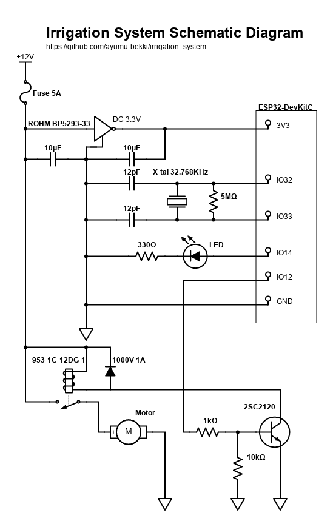

# Irrigation System

Automatic Irrigation System for ESP32

## Getting Started

### Dependencies

* ESP-IDF v4.3 (https://docs.espressif.com/projects/esp-idf/en/latest/esp32/get-started/)

### Executing program

* Open Irrigation System Configuration from make menuconfig and configure it.
* If necessary, change the serial port settings as well.
```
$ make menuconfig 
$ make flash monitor
```

### Web console

A web console is available, which can be accessed by entering the IP address in your web browser.
You can check the system's time and schedule, or run the watering manually.


### Schematic sample

This is a sample circuit diagram using ESP32-DevKitC.



## Authors

bekki.jp (http://blog.bekki.jp/)

## License

MIT License
