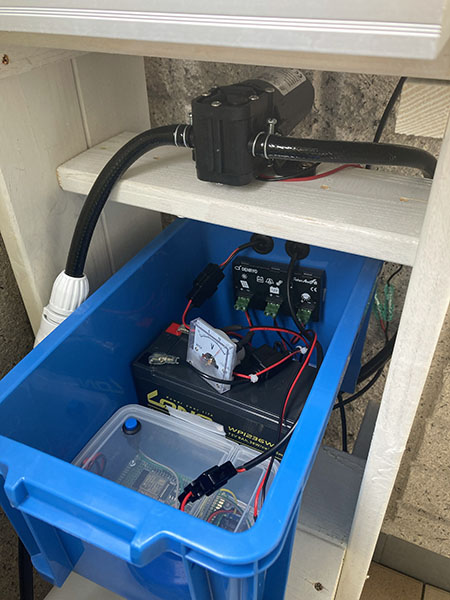
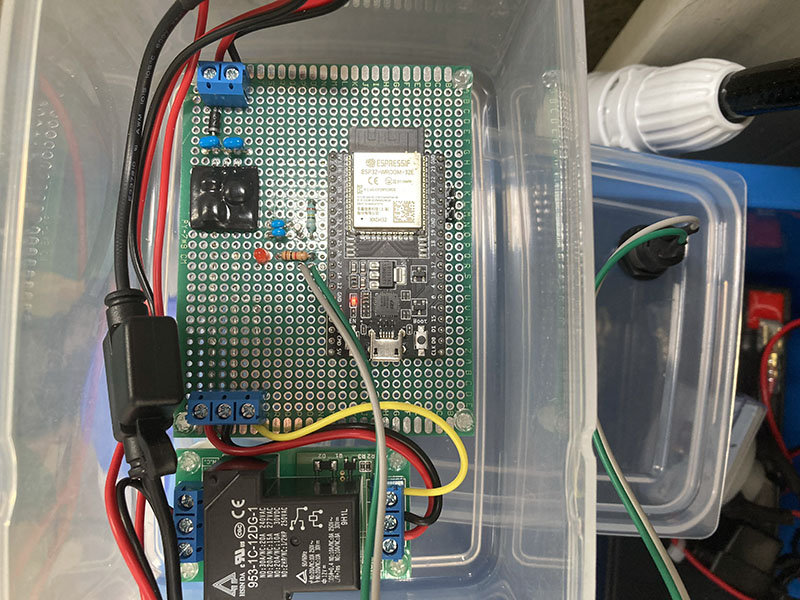

# Irrigation System

Automatic Irrigation System for ESP32-WROOM-32E

## Getting Started

### Dependencies

* ESP-IDF v4.3 (https://docs.espressif.com/projects/esp-idf/en/latest/esp32/get-started/)

### Executing program

* Open Irrigation System Configuration from make menuconfig and configure it.
* If necessary, change the serial port settings as well.

```
$ make menuconfig 
$ make flash monitor
```

#### Notification

If a 32kHz crystal does not exist, or if you have an ESP32-WROOM-32D or lower, you need to set the RTC clock source to Internal 150kHz RC oscillator.

```
make menuconfig
Component config -> ESP32-specific -> RTC clock source -> Internal 150kHz RC oscillator
```

### Web console

A web console is available, which can be accessed by entering the IP address in your web browser.
You can check the system's time and schedule, or run the watering manually.


### Schematic sample

This is a sample circuit diagram using ESP32-DevKitC (ESP32-WROOM-32E).


This The schematic was created using Scheme-it (https://www.digikey.jp/schemeit/).

### Use Cases

* 12V Diaphragm Pump (32W)
* Lead storage battery 12V 8.5Ah
* Solar cell 12V 8W
* Solar Charge controller (SolarAmp B)
* Takagi Easy Watering System (https://hi.takagi.co.jp/products/list.php?category_id=63)






## Authors

bekki.jp (http://blog.bekki.jp/)

## License

MIT License
