# Irrigation System

Automatic Irrigation System for ESP32-WROOM-32E

## Getting Started

### Dependencies

* ESP-IDF v5.1 (https://docs.espressif.com/projects/esp-idf/en/latest/esp32/get-started/)

### Executing program

* Open Irrigation System Configuration from menuconfig and configure it.
* Configure the Wi-Fi settings (SSID Password).
* If necessary, change the serial port settings as well.

```
$ idf.py menuconfig 
$ idf.py build flash monitor
```

#### Notification

If a 32kHz crystal does not exist, or if you have an ESP32-WROOM-32D or lower, you need to set the RTC clock source to Internal 150kHz RC oscillator.

```
$ idf.py menuconfig
Component config -> ESP32-specific -> RTC clock source -> Internal 150kHz RC oscillator
```

### Web console

A web console is available, which can be accessed by entering the IP address in your web browser.
You can check the system's time and schedule, or run the watering manually.


### Watering Setting File
If no configuration file has been registered, the message "No settings have been made."
You need to register the settings file in order for the irrigation schedule to work.

### Sample
This is a sample description of the irrigation setup.

* watering_setting_files/watering_setting_simple_exapmle.json
** This is a simple irrigation setup. Set the time to water and the length of time. 
* watering_setting_files/watering_setting_advanced_example.json 
** This is a advanced irrigation setup. It gets the weather forecast and schedules the best watering based on the maximum temperature rainy weather conditions. (For Tokyo)

### Schematic sample

This is a sample circuit diagram using ESP32-DevKitC (ESP32-WROOM-32E).



This The schematic was created using Scheme-it (https://www.digikey.jp/schemeit/).

### Use Cases

* 12V Diaphragm Pump (32W)
* Lead storage battery 12V 8.5Ah
* Solar cell 12V 8W
* Solar Charge controller (SolarAmp B)
* Takagi Easy Watering System (https://hi.takagi.co.jp/products/list.php?category_id=63)


## Authors

bekki.jp (http://blog.bekki.jp/)

## License

MIT License
